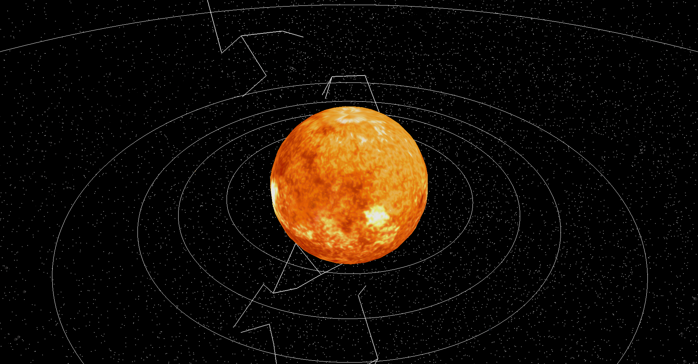
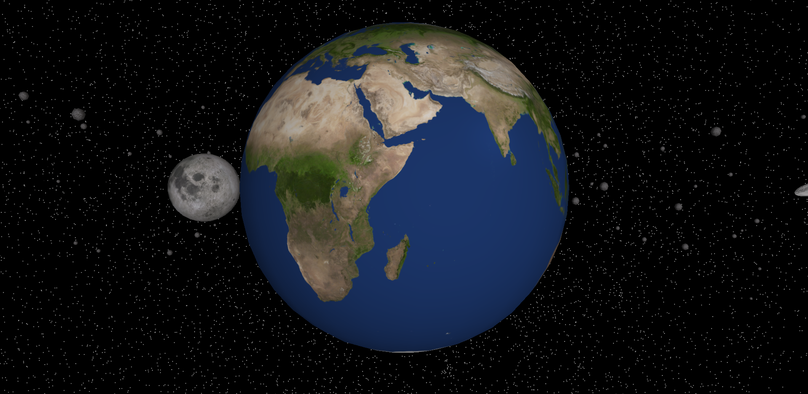
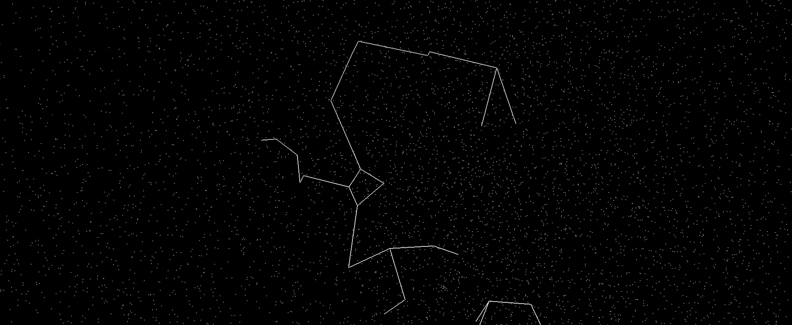

# Simulació del sistema solar i constel·lacions en Realitat Augmentada

Aquest projecte tracta de fer un simulador interactiu que permet visualitzar el Sistema Solar i les seves constel·lacions utilitzant principalment
les llibreries de moderngl i pygames de Python. L'objectiu és representar el Sistema Solar el més fidelment possible utilitzant les tècniques que s'han ensenyat
en Entorns Gràfics i Realitat Augmentada.

## 0. Estat de l'art

Alguns sistemes de visualització del sistema solar ja existents son els següents:

#### Stellarium:
 - Permet veure el cel de nit des de la terra.
 - El punt de vista és un lloc fixat de la terra. Es pot ajustar l'angulació de la càmera mitjançant el ratolí
 - L'usuari pot activar i desactivar algunes opcions per visualitzar el cel. Per exemple, les constel·lacions, el terra...
 - Si es fa click en un lloc de l'espai i hi ha algun cos, es proporciona informació relacionada a la part esquerra de la pàgina web

#### Eyes on the Solar System (NASA):
 - Permet veure el sistema solar.
 - La càmera es pot allunyar fins visualitzar tota la galàxia.
 - La càmera sempre mira cap el sol.
 - L'aplicació permet veure les òrbites dels planetes i altres cossos del sistema solar en temps real.
 - Es pot alterar el transcurs del temps, de manera que els planetes orbiten més o menys ràpid.
 - L'usuari pot activar i desactivar algunes opcions per visualitzar el cel. Per exemple, les constel·lacions, els planetes...

## 1. Requeriments
Tots els requisits necessaris per executar el codi es troben en la carpeta /environment. 

Si es vol executar el codi, has de seguir els passos de a continuació:
* 1: Clonar el repositori Github localment. 
* 2: Executar el arxiu main.py del repositori /codi.

## 2. Resultats
Us mostrem una seqüència d'imatges del què es pot trobar quan s'executi /codi/main.py:

## 3. Repositoris 
* /actes: Conté fitxers esmentant els comentaris de les reunions de grup. En les actes es pot veure com ha anat evolucionant el treball durant les setmanes de projecte. 
* /controls: Aquest directori conté els informes de les primeres entregues del treball. 
* /disseny: Estan tota mena d'arxius que ha servit d'ajuda a nivell de disseny de l'aplicació. 
* /environment: Es tenen els requisits per executar el codi.
* /codi: Tots els arxius i directoris necessaris per fer córrer l'aplicació.

## Referències i Motivacions
* Roman, N.G.; Warren Jr., W.H.; Schofield, N.J. (1983): "The Bright Star Catalogue, 4th Revised Ed." VizieR Online Data Catalog: V/53A. Disponible a https://vizier.cds.unistra.fr/viz-bin/VizieR?-source=V%2F53A. Darrer accés: 3 d'Octubre del 2024.

* "Where Can I Find a Visible Star Dataset?" Astronomy Stack Exchange, 4 Dec. 2017, Disponible a https://astronomy.stackexchange.com/questions/22802/where-can-i-find-a-visible-sta. Darrer accés: 3 d'Octubre del 2024.
  
* Stellarium Web (2024): "Stellarium Web Online Star Map." Disponible a https://stellarium-web.org. Darrer accés: 10 d'Octubre del 2024.
  
* NASA's Eyes (2024): "Eyes on the Solar System." Disponible a https://eyes.nasa.gov/apps/solar-system/#/home. Darrer accés: 10 d'Octubre del 2024.

* Banerjee, Sourav (2024): "Planet Dataset." Disponible a https://www.kaggle.com/datasets/iamsouravbanerjee/planet-dataset. Darrer accés: 16 de Octubre de 2024.

## Participants - Grup 2 EGRA
Guillem Garcia (NIU: 1636279)

Martí Llinés (NIU: 1637804)

David Montaña (NIU: 1564129)

Joel Tapia (NIU: 1638962)

